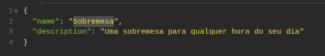
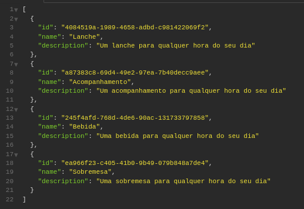
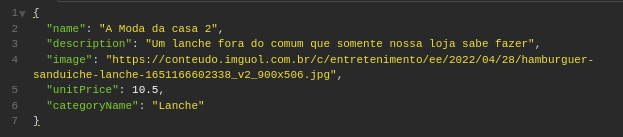
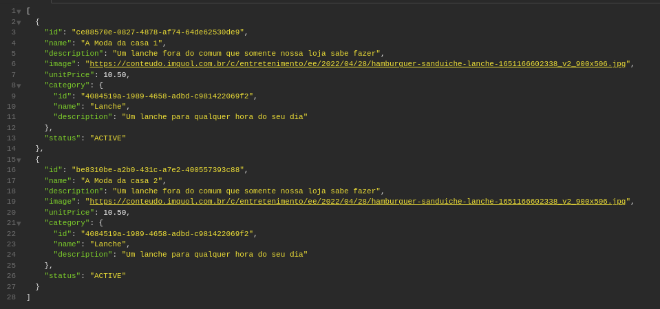
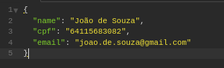
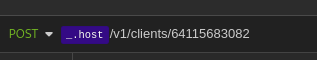
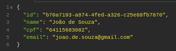
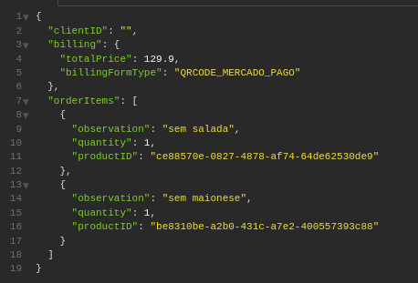
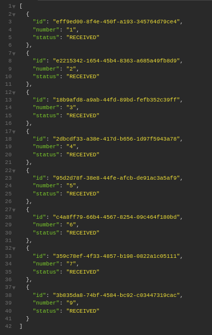

### [_<< ReadMe_](../README.md)

---

# Links e Arquivos
- [Miro](https://miro.com/app/board/uXjVMknkAg0=/?share_link_id=737021269632)
- [Swagger](assets%2Flanchonete-do-bairro.yaml)
- [Collection Insomnia](assets%2FCollection_Insomnia.json)

# Documentação
_Existe duas forma de acessar a documentação das APIs e obter todos os detalhes de schemas, methods, requestBody, responseBody e status:_
- Via request: [http://server:port/context-path/documentation](http://server:port/context-path/documentation)
  - ```server:``` The server name or IP
  - ```port:``` The server port (default 8081)
  - ```context-path:``` The context path of the application (default /api)
  - 
- Via UI: [http://server:port/context-path/swagger-ui/index.html](http://server:port/context-path/swagger-ui/index.html)
  - ```server:``` The server name or IP
  - ```port:``` The server port (default 8081)
  - ```context-path:``` The context path of the application (default /api)
  - 

# Rodando a aplicação

### Pré-requisito
- Ter o maven e o docker instalado na maquina

### Executando a aplicação
1 - A aplicação esta usando docker com isso para rodar a aplicação basta ir na pasta raiz executar o ```mvn clean install``` e rodar o comando ```sudo docker compose up -d``` o mesmo irá executar as seguintes etapas:
- Buildar a aplicação
- Configurar a rede interna
- Vincular as dependências entre os serviços de banco de dados e API
- Baixar todas as imagens necessárias incluindo o Java 11, banco de dados Postgres, Prometheus e Grafana
- Rodar o script inicial para a criação das tabelas
- Iniciar a aplicação na porta 8081
- Iniciar o prometheus na porta 9090
- Iniciar o grafana na porta 3000

2 - Rodar o comando ```sudo docker compose ps``` para verificar se o "State" está UP ou simplesmente chamar o health check que foi disponibilizado na [Collection Insomnia](assets%2FCollection_Insomnia.json)

3 - Executar as APIs

# Usando as APIs
*Todas as APIs estão disponibilizadas na [Collection Insomnia](assets%2FCollection_Insomnia.json) ou no Swagger (conforme inicio desta documentação)*
### Etapa 1 - Criando as categorias de produtos

*Para que seja possível o cadastro de produtos e consequentemente o cliente conseguir escolher o produto deve ser cadastrado todas as categorias que a lanchonete irá trabalhar. Neste momento será Lanche, Acompanhamento, Bebida e Sobremesa.*

1 - Localize a API Criar Categoria 

2 - Como requisito esta API necessita que sejá informada o nome e a descrição da categoria que deseja cadastrar



3 - Após preenchimento envie a requisição e se estiver tudo certo conforme as validações/regras de negócio a categoria será criada, caso contrario a API retornará o que aconteceu de errado.

4 - Após a criação das categorias execute a API Listar Categorias, caso você criou as 4 categorias o resultado será algo parecido com:



### Etapa 2 - Criando os produtos que serão vendidos

1 - Localize a API Criar Produto

2 - Como requisito esta API necessita que sejá informada o nome, descrição, imagem, preço unitário e a categoria que o produto pertence



3 - Após preenchimento envie a requisição e se estiver tudo certo conforme as validações/regras de negócio o produto será criada e vinculado a categoria informada, caso contrario a API retornará o que aconteceu de errado.

4 - Após a criação dos produtos execute a API Listar Produtos pelo identificador da categoria para ver os produtos cadastrados e vinculados a esta categoria, o resultado será algo parecido com:



### Etapa 3 - Cadastrando o Cliente

1 - Localize a API Criar Cliente

2 - Como requisito esta API necessita que sejá informada as informações de nome, cpf e email



3 - Após preenchimento envie a requisição e se estiver tudo certo conforme as validações/regras de negócio o cliente será criado, caso contrario a API retornará o que aconteceu de errado.

4 - Após a criação do pedido execute a API Identificar Cliente conforme a etapa 4

### Etapa 4 - Identificando o Cliente

1 - Localize a API Identificar Cliente

2 - Como requisito esta API necessita que sejá informada cpf



3 - Após preenchimento envie a requisição e se estiver tudo certo conforme as validações/regras de negócio o cliente será identificado, caso contrario a API retornará o que aconteceu de errado.

4 - Após a identificação do cliente com sucesso o resultado será algo parecido com:



### Etapa 5 - Realizando o pedido

1 - Localize a API Checkout Pedido

2 - Como requisito esta API necessita que sejá informada as informações de cobrança e os itens do pedido, caso o cliente queira se identificar poderá ser preenchido o seu ID



3 - Após preenchimento envie a requisição e se estiver tudo certo conforme as validações/regras de negócio o pedido será criado com status inicial de Recebido, caso contrario a API retornará o que aconteceu de errado.

4 - Após a realização do pedido execute a API Listar Pedidos com status de Recebido para ver os pedidos realizados e com status Recebido, o resultado será algo parecido com:




### Parando a aplicação
1 - Entrar na raiz do projeto

2 - Executar o comando para listar todos os containers  ```sudo docker ps```

3 - Executar o comando  ```sudo docker stop <container>```

# Monitorando a aplicação

### Analisando o log da aplicação via docker
- 1 - asdfasdf asdfasdf asdfasdf asdfasdf

### Acessando o prometheus
- 1 - asdfasdf asdfasdf asdfasdf asdfasdf

### Acessando o grafana
- 1 - asdfasdf asdfasdf asdfasdf asdfasdf

# Cobertura de Teste Unitário
- 1 - asdfasdf asdfasdf asdfasdf asdfasdf