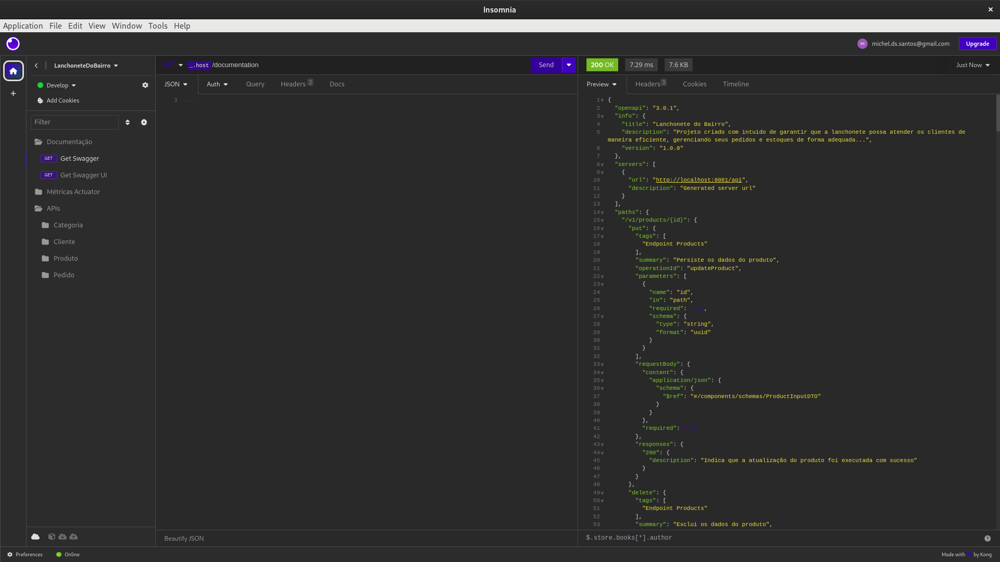
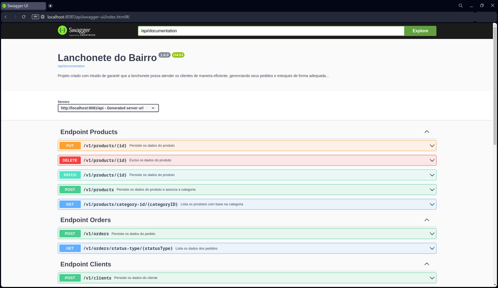

### [_<< ReadMe_](../README.md)

---

# Links e Arquivos
- [Miro](https://miro.com/app/board/uXjVMknkAg0=/?share_link_id=737021269632)
- [Swagger](assets%2Flanchonete-do-bairro.yaml)
- [Collection Insomnia](assets%2FCollection_Insomnia.json)

# Documentação
_Existe duas forma de acessar a documentação das APIs e obter todos os detalhes de schemas, methods, requestBody, responseBody e status:_
- Via request: [http://server:port/context-path/documentation](http://server:port/context-path/documentation)
  - ```server:``` The server name or IP
  - ```port:``` The server port (default 8081)
  - ```context-path:``` The context path of the application (default /api)
  - 
- Via UI: [http://server:port/context-path/swagger-ui/index.html](http://server:port/context-path/swagger-ui/index.html)
  - ```server:``` The server name or IP
  - ```port:``` The server port (default 8081)
  - ```context-path:``` The context path of the application (default /api)
  - 

# Rodando a aplicação

### Pré-requisito
- Ter o maven e o docker instalado na maquina

### Executando a aplicação
1 - A aplicação esta usando docker com isso para rodar a aplicação basta ir na pasta raiz executar o ```mvn clean install``` e rodar o comando ```sudo docker compose up -d``` o mesmo irá executar as seguintes etapas:
- Buildar a aplicação
- Configurar a rede interna
- Vincular as dependências entre os serviços de banco de dados e API
- Baixar todas as imagens necessárias incluindo o Java 11, banco de dados Postgres, Prometheus e Grafana
- Rodar o script inicial para a criação das tabelas
- Iniciar a aplicação na porta 8081
- Iniciar o prometheus na porta 9090
- Iniciar o grafana na porta 3000

2 - Rodar o comando ```sudo docker compose ps``` para verificar se o "State" está UP ou simplesmente chamar o health check que foi disponibilizado na [Collection Insomnia](assets%2FCollection_Insomnia.json)

3 - Executar as APIs

### Parando a aplicação
1 - Entrar na raiz do projeto

2 - Executar o comando para listar todos os containers  ```sudo docker ps```

3 - Executar o comando  ```sudo docker stop <container>```

# Monitorando a aplicação

### Analisando o log da aplicação via docker
- 1 - asdfasdf asdfasdf asdfasdf asdfasdf

### Acessando o prometheus
- 1 - asdfasdf asdfasdf asdfasdf asdfasdf

### Acessando o grafana
- 1 - asdfasdf asdfasdf asdfasdf asdfasdf

# Cobertura de Teste Unitário
- 1 - asdfasdf asdfasdf asdfasdf asdfasdf